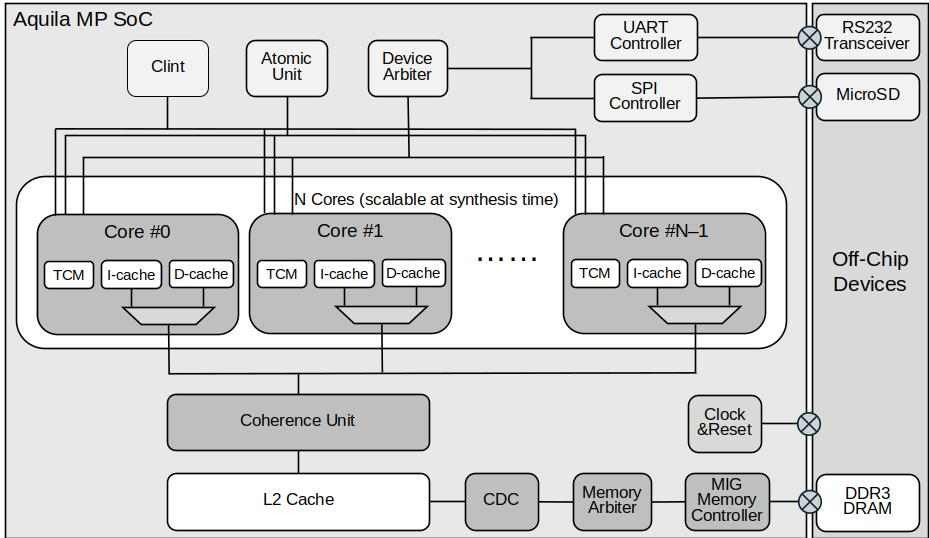
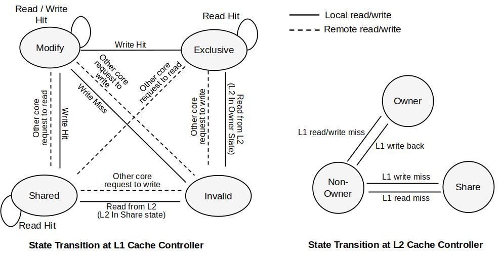

# The Scalable Symmetric Multiprocessor (SMP) RISC-V SoC

---

Aquila-mp is an open-source scalable symmetric multicore processor SoC that can be scaled to arbitrary number of cores. On the low-cost Genesys2 FPGA board, we have tested up to 16 cores. Each core is a 32-bit RISC-V processor, from [Aquila SoC](https://github.com/eisl-nctu/aquila). It employs the MESI cache coherence protocol to maintain data consistency across L1 and L2 caches in a shared memory system. The processor supports atomic instructions for efficient synchronization and mutual exclusion in multicore environments. Developed using Verilog HDL, the system is synthesized with the Xilinx Vivado toolchain and verified on several FPGA platforms, including Arty A7-100T, Xilinx KC705, and Genesys2.

---

## **Specification**

Current features of the Aquila-mp SoC used in this project include:

- RV32IMA ISA-compliant.
- Embedded tightly-coupled on-chip memory (TCM).
- 16KB L1 instruction caches, 16KB data caches. (Configurable)
- 256KB L2 cache. (Configurable)
- Multi-core support with coherent data cache controller.
- The number of cores is configurable in the RTL design, allowing selection from 1 up to N cores.
- CLINT for standard timer interrupts.
- The RTL model written in Verilog.
- SD card I/O support.
- FreeRTOS SMP support

---

## **Performance**
The design has been verified using a Xilinx Kintex-7 XC7K325T FPGA device with up to 16 cores at 60MHz, where the parallel computing performance is up to 13 times faster than that of a single core configuration. The scalability of the proposed design is only limited by the logic capacity of the FPGA devices.

## **MESI FSM Diagram**  
The MESI protocol's FSM is visualized below:  

---

## **User's Guide**
For detailed instructions on how to set up and use the Aquila-mp SoC, please refer to the [User's Guide](docs/user_guide.md).

---

## **Contributors**  
This project is based on the Aquila core project at [Aquila GitHub Repository](https://github.com/eisl-nctu/aquila)

The multi-core system is constructed by the following contributors, Tzu-Chen Yang, Ye Chen, Lin-En Yen, Yu-Ting Lee, and Chun-Jen Tsai, from the Embedded Intelligent Systems Laboratory (EISL) at National Yang Ming Chiao Tung University (NYCU). We acknowledge the support and collaboration from the open-source community and our academic partners.

## **Current Work**
Integration of a Memory Management Unit (MMU) to enable Linux OS support.

---

## **Folder and File Descriptions**

### **sw/**  
- **elibc/** – Basic C header library  
- **FreeRTOS/** – FreeRTOS/SMP library for aquila-mp   
- **rtos_matrix/** – Matrix multiplication evaluation code for multi-core based on FreeRTOS
- **rtos_sorting/** – Array sorting evaluation code for multi-core based on FreeRTOS
- **rtos_mlp/** – A Multi-Level Perceptron test code for multi-core parallel execution based on FreeRTOS
- **rtos_lenet5/** – Lenet-5 convolutional neural network evaluation code for multi-core parallel execution based on FreeRTOS
- **uartboot/** – Contains UART boot code for all processor cores

### **hw/src/**
- **core_rtl/** – Contains the RTL source code for the Aquila processor core, including modules such as the ALU, control unit, and register file.
- **ip/** - Contains the DDR4 memory configuration file of the MIG controller
- **mig/** - Contains the DDR3 memory configuration file of the MIG controller
- **mem/** – Contains the pre-compiled bootrom code in Vivado memory file format
- **soc_rtl/** – Contains the top-level RTL code for the Aquila SoC

### **hw/tb_verilator/**
- Contains testbenches for Verilator simulation

### **hw/tcl/**
- **build_arty100.tcl** - Script to create the Vivado workspace of Aquila-mp SoC for the Arty A7-100T board
- **hw/tcl/build_qmcore.tcl** - Script to create the Vivado workspace of Aquila-mp SoC for the QMTech board
- **hw/tcl/build_genesys2.tcl** - Script to create the Vivado workspace of Aquila-mp SoC for the Genesys2 board
- **hw/tcl/build_kc705.tcl** - Script to create the Vivado workspace of Aquila-mp SoC for the Xilinx KC705 board
